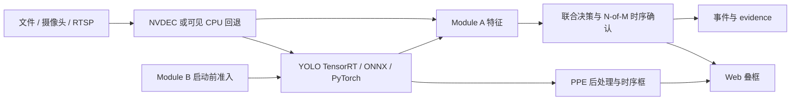

# 联合防御模块

视频安全检测演示项目。两条防线：

- **Module A**：视频运行时检测物理扰动、致盲、遮挡、静态媒体翻拍和对抗补丁。
- **Module B**：模型运行前做哈希准入、投毒扫描、净化、白名单和加速格式导出。

FastAPI 提供 Web 界面。Pixi 固定运行环境。GPU 路径优先使用 NVDEC、TensorRT、CUDA 光流和 Rust 原生算子；回退原因进入状态和日志。

> **风险边界**：当前攻击数据少。项目是研究/演示系统，不是安全认证产品。不能单独承担人员安全、生产停机或合规决策。

## 生产口径

- 主项目：`model/`
- Web 配置：`model/configs/module_a_runtime.yaml`
- 唯一生产 YOLO 源模型：`素材/model/yolov8/mask_bd_v4_clean_baseline.pt`
- 模型 SHA-256：`4D7A23D3866AC2D9DB6E59AE537DA1274D988BD53CA6C7D519297FCBB96626F8`
- ONNX/TensorRT 只能从该模型派生并绑定该哈希。
- `rebuilt_demo/` 只保留历史审计用途。生产代码不得读取或回退到它。

## 运行链路



Module A 主要信号：

- `A1`：单帧 LBP 纹理偏移、局部集中度、目标 ROI 关系。
- `A2`：跨帧 LBP 变化、局部突发、运动可解释性。
- `A3`：RAFT TensorRT / GPU LK / DIS 光流残差、局部异常运动。
- `A3b`：矩形边缘、平面启发式、跟踪和内外运动差；后台异步运行。
- `A4`：96 维 XGBoost 对抗补丁救援分类器，加规则融合保底。
- `Blind`：相对场景基线检测强光、模糊、可见性退化和目标骤失。

详细实现与数据风险：[`docs/技术.算法/2026-07-18-项目介绍-A模块实现与数据风险.md`](docs/技术.算法/2026-07-18-项目介绍-A模块实现与数据风险.md)

## 启动

环境：Windows、Pixi。NVIDIA CUDA 用于最佳演示；CPU 仅兼容回退。

```powershell
cd <repo-root>
pixi install --locked
pixi run native-install
pixi run verify-inference
pixi run monitor
```

浏览器默认访问 `http://127.0.0.1:7860/`。也可双击根目录 `start_web.bat`。

所有命令从仓库根目录执行。不要用全局 Python 启动。

## 运行数据

- 主项目默认写 `model/runtime/`。
- 环境变量 `DEFENSE_RUNTIME_DATA_ROOT` 可指定其他绝对目录。
- 交付启动器默认写 `%LOCALAPPDATA%\JointDefense\runtime`，避免污染解压包。
- catalog、evidence、Module B 白名单/净化输出、视频缓存、YOLO 配置都归入统一运行根目录。

## 验证

```powershell
cd <repo-root>
pixi run smoke
pixi run verify-module-a-artifacts
pixi run verify-inference
```

测试通过只证明代码契约和当前样本表现。不能替代跨摄像头、跨设备、跨编码、跨场景真实验收。

## 目录

- `model/src/defense/module_a/`：Module A 生产实现。
- `model/src/defense/model_security/`：Module B 联合运行层。
- `model/src/model_security_gate/`：Module B 算法与准入能力。
- `model/src/defense/pipelines/`：解码、推理、叠框和时序链路。
- `model/native/module_a_native/`：Rust/PyO3 原生算子。
- `model/tests/`：契约、回归、GPU/native 门禁。
- `docs/技术.算法/`：设计、实验、风险和交付记录。

## 数据风险摘要

当前权威 Web 验收集只有 `36` 段：`30` 段正常、`5` 类物理攻击各 `1` 段、A3b 正例 `1` 段。攻击正例不足以证明泛化。

主要风险：

- 同一视频大量相邻帧高度相关。帧数大，不等于独立样本多。
- A4 训练大量依赖合成载体。可能学习生成器、编码器、贴纸颜色和运动轨迹捷径。
- 权威视频参与过调参与回归。它们是开发/验收材料，不是严格独立测试集。
- 新摄像头、压缩率、分辨率、夜间、雨雾、逆光、抖动、多人遮挡可能改变误报和漏报。
- 当前 `0` 误报或高 AUC 只适用于对应样本和口径，不能外推为生产误报率。

提交生产前：补真实攻击、按场景/设备隔离划分、冻结独立终测集、跑长时正常流、报告视频级召回和误报置信区间。
