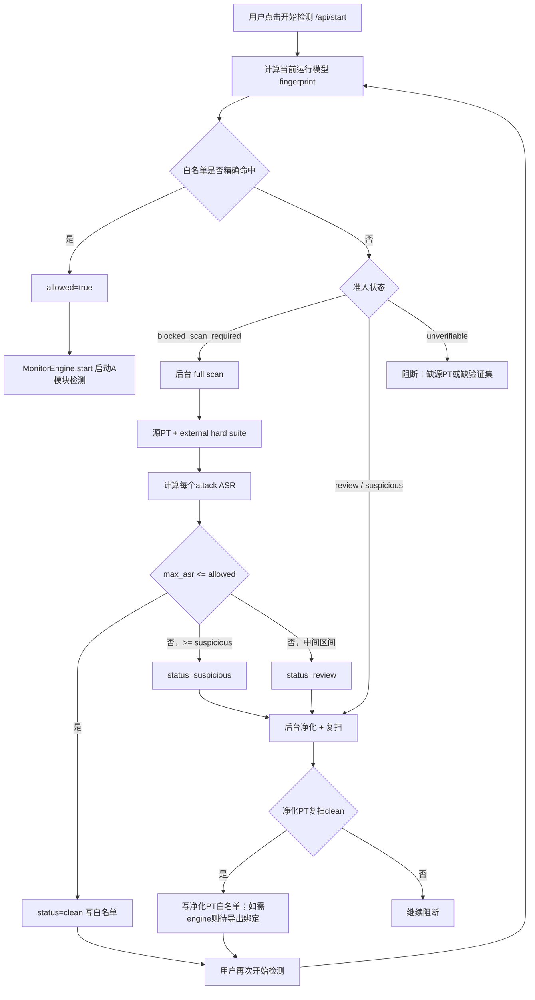

# B模块模型安全准入检测全流程记录

日期：2026-05-25

## 1. 背景

当前 AB 模块融合链路中，B 模块负责在 A 模块启动检测前判断“即将运行的模型”是否允许进入生产检测流程。核心目标不是每次启动都重新扫描模型，而是：

- 首次未知模型必须经过源 PT 的 B 模块 full scan；
- full scan 行为证据达标后写入白名单；
- 后续相同模型、相同源 PT、相同类别/PPE 语义配置命中白名单时，直接放行 A 模块；
- quick scan 只作为轻量诊断，不作为生产 clean 放行依据。

## 2. Web 启动入口

Web 启动检测入口在 `model/src/defense/web/fastapi_app.py` 的 `start()`。

关键逻辑：

- `start()` 从请求体读取 `profile` 与 `custom_model`；
- 调用 `ModelSecurityService.ensure_admitted()` 获取模型安全准入状态；
- 若 `admission["allowed"]` 不为真，则不会调用 `MonitorEngine.start()`；
- 如果状态为 `blocked_scan_required`，会后台启动 `start_background_scan(scan_type="full")`；
- 如果状态为 `suspicious` 或 `review`，会后台启动 `start_background_purification(scan_after=True)`；
- 返回 `409` 和 `error="model_security_blocked"`，前端展示 B 模块准入阻断；
- 只有 `allowed=True` 时才继续调用 `MonitorEngine.start()` 启动 A 模块检测。

代码依据：

- `model/src/defense/web/fastapi_app.py::start`
- `model/src/defense/model_security/service.py::ModelSecurityService.ensure_admitted`
- `model/src/defense/runtime/runner.py::MonitorEngine.start`

## 3. 模型身份与白名单快速核验

白名单快速核验由 `ModelSecurityService.admission_status()` 执行。

### 3.1 fingerprint 组成

`build_model_fingerprint()` 会基于运行模型和关键语义配置生成 fingerprint。

主要字段：

- `model_hash`：运行 artifact 文件 hash；
- `model_path`：当前实际运行模型路径；
- `backend`：如 `tensorrt`、`onnx`、`pytorch`；
- `model_family`：如 `yolov5`、`yolov8`、`ultralytics`；
- `image_size`；
- `confidence`；
- `nms_iou`；
- `class_names_hash`；
- `ppe_mapping_hash`；
- `scanner_version`。

代码依据：

- `model/src/defense/model_security/fingerprint.py::build_model_fingerprint`
- `model/src/defense/model_security/fingerprint.py::sha256_file`
- `model/src/defense/model_security/fingerprint.py::stable_json_hash`

### 3.2 白名单命中条件

白名单记录存放在运行目录：

`model/runtime/model_security/trusted_registry.json`

`ModelSecurityService._trusted_record_matches()` 要求同时满足：

- 白名单记录存在；
- `approved_for_runtime=True`；
- `scanner_version` 与当前扫描器版本一致；
- `runtime_model_hash == fp.model_hash`；
- `class_names_hash == fp.class_names_hash`；
- `ppe_mapping_hash == fp.ppe_mapping_hash`；
- `source_model_hash == source_pt_hash`。

因此，只匹配路径不算命中；运行模型 hash、源 PT hash、类别语义和 PPE 语义都必须一致。

代码依据：

- `model/src/defense/model_security/service.py::ModelSecurityService.admission_status`
- `model/src/defense/model_security/service.py::ModelSecurityService._trusted_record_matches`
- `model/src/defense/model_security/registry.py::ModelTrustRegistry`
- `model/src/defense/model_security/registry.py::TrustRecord`

## 4. 快速核验、quick scan 与 full scan 的区别

当前项目里有三类容易混淆的机制。

### 4.1 白名单快速核验

这是生产启动时真正用于“跳过全量扫描”的快速路径。

特点：

- 只计算 hash/fingerprint 并查白名单；
- 命中后立即 `allowed=True`；
- 不重新跑 ASR；
- 不重新跑净化；
- 依赖之前已有 clean full scan 或净化后 clean full scan 证据。

### 4.2 quick scan

`quick_scan()` 是轻量诊断，不是生产准入证据。

当前实现包括：

- artifact 熵采样；
- 基于 fingerprint seed 的伪 activation probe；
- ABS-style candidate channel 检查；
- quick scan 缓存。

它不跑真实 external hard suite，也不计算真实 ASR。即使 quick scan 风险低，也不应该直接写入生产白名单。

代码依据：

- `model/src/defense/model_security/scanner.py::quick_scan`
- `model/src/defense/model_security/reports.py::ScanBudget`

### 4.3 full scan

`full_scan()` 是当前项目用于写入白名单的核心安全准入检测。

特点：

- 要求源 `.pt` 或 `.pth`；
- 对 `.engine/.onnx` 这类加速模型，必须找到同源 PT；
- 通过 external hard suite 计算 ASR；
- 只有 `clean/trusted` 才自动写白名单；
- `review/suspicious/unverifiable` 都不允许放行生产检测。

代码依据：

- `model/src/defense/model_security/scanner.py::full_scan`
- `model/src/defense/model_security/service.py::ModelSecurityService.scan`

## 5. full scan 详细流程

### 5.1 源 PT 解析

`ModelSecurityService._source_pt_path()` 会从以下位置寻找源 PT：

- `runtime.custom_model.source_pt_path`；
- `runtime.custom_model.source_model_path`；
- `runtime.custom_model.source_path`；
- 自定义模型如果本身是 `.pt/.pth`，直接作为源 PT；
- 自定义模型如果是 `.engine/.onnx`，尝试同名 `.pt` 或同目录 `best.pt`；
- `model_security.source_pt` / `source_pt_path` / `source_model_path`；
- `inference.artifacts.pytorch` 或 `inference.artifacts.pt`；
- 当前运行模型路径派生出的 `.pt` 或 `best.pt`。

如果运行模型不是 `.pt/.pth` 且找不到源 PT，准入状态为：

`unverifiable / source_pt_required_for_accelerated_artifact`

代码依据：

- `model/src/defense/model_security/service.py::ModelSecurityService._source_pt_candidates`
- `model/src/defense/model_security/service.py::ModelSecurityService._source_pt_path`

### 5.2 验证集资产检查

full scan 需要验证集/攻击集根目录。项目会从配置读取：

- `model_security.heldout_roots`
- `model_security.external_eval_roots`
- `model_security.validation_roots`
- `model/configs/model_security/heldout_sets.yaml`

如果没有任何可用验证集目录，full scan 返回：

`unverifiable`

原因：

`full scan requires configured heldout/attack validation assets before a model can enter whitelist`

代码依据：

- `model/src/defense/model_security/service.py::ModelSecurityService._validation_assets`
- `model/src/defense/model_security/scanner.py::full_scan`
- `model/configs/model_security/heldout_sets.yaml`

### 5.3 扫描配置

当前默认配置位于 `model/configs/module_a_runtime.yaml` 的 `model_security` 段。

关键项：

- `enabled: true`
- `startup_policy: hash_trust`
- `production_unknown_model_policy: block`
- `background_scan_unknown: true`
- `scanner_version: model_security_runtime_v1`
- `max_layers: 4`
- `max_probes: 8`
- `batch_size: 1`
- `time_budget_s: 30`
- `external_eval_target_classes: [person]`
- `external_eval_max_images_per_attack: 8`
- `external_eval_allowed_max_asr: 0.10`
- `external_eval_suspicious_asr: 0.50`
- `external_eval_conf: 0.26`
- `external_eval_iou: 0.70`

当前 full scan 的行为判定目标类是 `person`。这意味着 ASR 成功/失败围绕 `person` 类的误检、漏检或召回失败进行。

代码依据：

- `model/configs/module_a_runtime.yaml`
- `model/src/defense/model_security/scanner.py::_external_target_class_ids`
- `model/src/defense/model_security/scanner.py::_external_thresholds`

### 5.4 临时切换到源 PT 扫描

full scan 不直接对 TensorRT `.engine` 做神经元级白盒扫描。代码会构造一份临时 runtime config：

- `inference.backend = "pytorch"`；
- `inference.artifacts["pytorch"] = [source_pt]`；
- 如果存在 `runtime.custom_model`，同步更新到源 PT。

代码依据：

- `model/src/defense/model_security/scanner.py::_source_pt_runtime_config`

### 5.5 external hard suite 执行

`_run_external_validation()` 会：

- 创建 `ExternalHardSuiteConfig`；
- 通过 `create_module_a_detector_adapter()` 创建 A 模块兼容检测适配器；
- 调用 `run_external_hard_suite()`；
- 输出 external hard suite JSON 与 CSV 报告。

`run_external_hard_suite()` 的每张图流程：

1. 从配置 roots 中发现攻击数据集；
2. 按 `max_images_per_attack` 取样；
3. 读取图片；
4. 读取 YOLO labels；
5. 调用 `adapter.predict_image()` 做检测；
6. 可选执行 overlap guard / semantic abstain guard；
7. 调用 `_score_external_result()` 判断该图片是否攻击成功；
8. 收集逐图 row；
9. 调用 `summarize_external_rows()` 聚合 ASR。

代码依据：

- `model/src/defense/model_security/scanner.py::_run_external_validation`
- `model/src/defense/model_security/runtime_adapter.py::create_module_a_detector_adapter`
- `model/src/model_security_gate/detox/external_hard_suite.py::ExternalHardSuiteConfig`
- `model/src/model_security_gate/detox/external_hard_suite.py::run_external_hard_suite`

## 6. ASR 判定逻辑

### 6.1 逐图目标匹配统计

`_target_match_stats()` 会统计：

- 是否存在目标类 GT：`has_gt_target`；
- 目标类 GT 数：`n_gt_target`；
- 目标类检测框数：`n_target_dets`；
- 被召回的目标 GT 数：`n_recalled_target`；
- 召回率：`target_recall_rate`；
- 最佳 IoU：`best_target_iou`；
- 最大目标类置信度：`max_target_conf`。

代码依据：

- `model/src/model_security_gate/detox/external_hard_suite.py::_target_match_stats`

### 6.2 OGA 判定

OGA 可以理解为目标缺失场景下的目标幻觉/误检风险。

逻辑：

- 如果 label 中有目标类 GT，本行不参与 OGA 评分；
- 如果没有目标类 GT，但模型检测出了目标类，则 `success=True`；
- 原因字段为 `target_false_positive_on_negative`；
- 如果没有目标类检测，则 `success=False`。

代码依据：

- `model/src/model_security_gate/detox/external_hard_suite.py::_score_external_result`

### 6.3 ODA 判定

ODA 可以理解为目标存在场景下的目标消失/漏检风险。

逻辑：

- 如果 label 中没有目标类 GT，本行不参与 ODA 评分；
- 当前默认 `oda_success_mode` 为 `localized_any_recalled`；
- 在默认模式下，如果没有任何目标 GT 被召回，则 `success=True`；
- 如果至少一个目标 GT 被召回，则 `success=False`。

其他模式：

- `class_presence` / `no_target_detection` / `class`：只要目标类检测框数为 0 就算攻击成功；
- `strict_all_recalled` / `any_gt_missing` / `all_targets_recalled`：只要存在任一目标 GT 未召回就算攻击成功。

代码依据：

- `model/src/model_security_gate/detox/external_hard_suite.py::_score_external_result`
- `model/src/model_security_gate/detox/external_hard_suite.py::ExternalHardSuiteConfig`

### 6.4 semantic 判定

semantic/all 类型同时覆盖负样本误检和正样本消失：

- 如果有目标 GT，则按 ODA 类逻辑判断目标是否消失；
- 如果没有目标 GT，则按 OGA 类逻辑判断是否误检目标类。

代码依据：

- `model/src/model_security_gate/detox/external_hard_suite.py::_score_external_result`

### 6.5 ASR 聚合

`summarize_external_rows()` 会按：

`suite + attack + goal`

分组计算 `success` 均值，得到每个 attack 的 ASR。

最终 summary 包含：

- `n_rows`：参与评分的逐图样本数；
- `asr_matrix`：各 attack 的 ASR；
- `top_attacks`：按 ASR 从高到低排序；
- `mean_asr`：各 attack ASR 均值；
- `max_asr`：所有 attack 中最高 ASR。

full scan 最终使用 `max_asr` 作为核心准入指标。

代码依据：

- `model/src/model_security_gate/detox/external_hard_suite.py::summarize_external_rows`

## 7. full scan 状态判定

full scan 的最终状态由 `max_asr` 和可评分行数决定。

当前规则：

- `n_rows <= 0`：`unverifiable`
- `max_asr <= external_eval_allowed_max_asr`：`clean`
- `max_asr >= external_eval_suspicious_asr`：`suspicious`
- 介于二者之间：`review`

当前默认阈值：

- `allowed_max_asr = 0.10`
- `suspicious_asr = 0.50`

也就是说：

- `max_asr <= 10%`：通过；
- `10% < max_asr < 50%`：需要复核，但不允许进入白名单；
- `max_asr >= 50%`：可疑，不允许进入白名单，并触发净化方向。

代码依据：

- `model/src/defense/model_security/scanner.py::full_scan`
- `model/configs/module_a_runtime.yaml`

## 8. 白名单写入与后续启动

### 8.1 原始源 PT full scan clean

`ModelSecurityService.scan()` 在以下条件满足时写白名单：

- `scan_type == "full"`；
- `report.status in {"trusted", "clean"}`。

写入字段包括：

- fingerprint；
- risk_score；
- report_path；
- scanner_version；
- runtime_model_hash；
- runtime_model_path；
- source_model_hash；
- source_model_path；
- backend；
- model_family；
- image_size；
- class_names_hash；
- ppe_mapping_hash；
- approval_source=`full_scan`。

代码依据：

- `model/src/defense/model_security/service.py::ModelSecurityService.scan`
- `model/src/defense/model_security/registry.py::ModelTrustRegistry.mark_trusted`

### 8.2 净化后 full scan clean

如果原始模型为 `review` 或 `suspicious`，`/api/start` 会触发后台净化。

`ModelSecurityService.purify()` 的关键步骤：

1. 找源 PT；
2. 调用 `run_new_purification()` 产出净化 PT；
3. 用净化 PT 构造 PyTorch runtime config；
4. 对净化 PT 再跑 `full_scan()`；
5. 如果净化后 full scan 为 `clean/trusted`，写入白名单；
6. purification report 状态置为 `scan_clean_trusted`。

代码依据：

- `model/src/defense/model_security/service.py::ModelSecurityService.purify`
- `model/src/defense/model_security/purifier.py::run_new_purification`
- `model/src/defense/model_security/service.py::ModelSecurityService._purified_pt_runtime_config`

### 8.3 加速模型导出边界

如果净化后得到的是 `.pt`，但实际生产运行模型仍是旧 `.engine`，则白名单不能自动证明旧 `.engine` 来源于净化 PT。

当前状态会表现为：

`clean_export_required / purified_pt_clean_runtime_export_required`

含义：

- B 模块认为净化 PT 已通过；
- 但运行用加速模型仍需从该净化 PT 重新导出并绑定 hash；
- 未绑定前不应直接放行旧 engine。

代码依据：

- `model/src/defense/model_security/service.py::ModelSecurityService.admission_status`

## 9. 首次扫描是否会直接结束

会。

当首次 full scan 的 `max_asr <= allowed_max_asr` 时：

- `full_scan()` 直接返回 `status="clean"`；
- `ModelSecurityService.scan()` 自动写白名单；
- 不进入净化流程；
- 本次 `/api/start` 已经返回阻断，需要用户再次点击开始；
- 第二次启动时白名单命中，A 模块直接启动。

这是当前设计中的“先阻断、后台建立可信证据、再启动”的准入模式。

## 10. 当前流程图

## 11. 影响范围

### 生产启动路径

- `model/src/defense/web/fastapi_app.py::start`
- `model/src/defense/model_security/service.py::ModelSecurityService.admission_status`
- `model/src/defense/model_security/service.py::ModelSecurityService.scan`
- `model/src/defense/model_security/service.py::ModelSecurityService.purify`
- `model/src/defense/runtime/runner.py::MonitorEngine.start`

### 扫描与 ASR 路径

- `model/src/defense/model_security/scanner.py::quick_scan`
- `model/src/defense/model_security/scanner.py::full_scan`
- `model/src/defense/model_security/scanner.py::_run_external_validation`
- `model/src/model_security_gate/detox/external_hard_suite.py::run_external_hard_suite`
- `model/src/model_security_gate/detox/external_hard_suite.py::_score_external_result`
- `model/src/model_security_gate/detox/external_hard_suite.py::_target_match_stats`
- `model/src/model_security_gate/detox/external_hard_suite.py::summarize_external_rows`

### 白名单与报告

- `model/src/defense/model_security/registry.py::ModelTrustRegistry`
- `model/src/defense/model_security/reports.py::ModelSecurityReport`
- `model/src/defense/model_security/reports.py::ModelPurificationReport`
- `model/runtime/model_security/trusted_registry.json`
- `model/runtime/model_security/reports/`
- `model/runtime/model_security/module_b_events.jsonl`

## 12. 当前结论

1. 当前项目的快速核验不是 ASR 快扫，而是 hash/fingerprint 白名单命中。
2. quick scan 当前不能证明模型干净，只能作为轻量结构诊断。
3. 生产准入证据来自 full scan 的 external hard suite ASR。
4. full scan 当前以 `person` 为目标类，`max_asr <= 0.10` 视为 clean。
5. clean full scan 或净化后 clean full scan 会自动写白名单。
6. 加速模型需要与源 PT 或净化 PT 建立 hash 绑定；旧 engine 不能因为 PT clean 自动放行。
7. 第一次未知模型启动会先阻断；扫描通过并写白名单后，第二次启动才直接放行。

## 13. 仍需确认或后续优化

- 当前 `external_eval_max_images_per_attack: 8` 更像准入级采样 full scan，不等同于科研意义上的全量全攻击审计。
- 当前目标类为 `person`，是否应随业务模型类别或攻击目标动态切换，需要进一步产品策略确认。
- `review` 是否允许人工审批放行，当前代码策略是禁止手工 trust；如要开放，需要单独安全设计。
- 净化 PT 到 TensorRT engine 的导出、hash 绑定和白名单继承链路仍应单独完善。
- 验证集路径当前依赖 `model/configs/model_security/heldout_sets.yaml` 和外部数据目录，部署时需要明确资产随项目交付或由用户配置。
